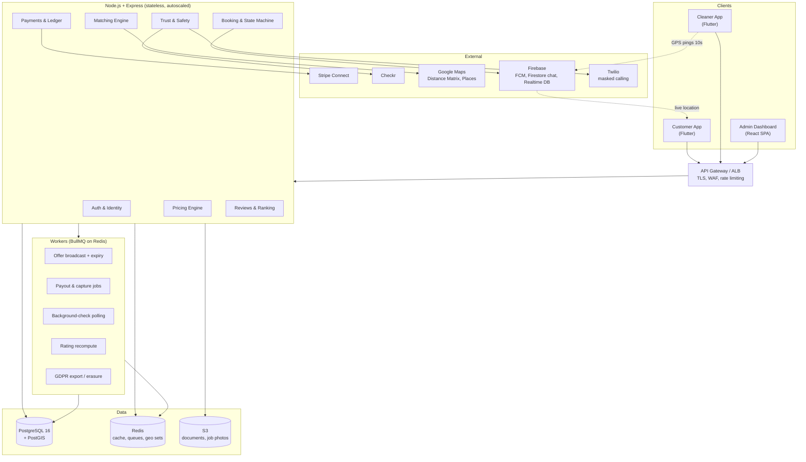
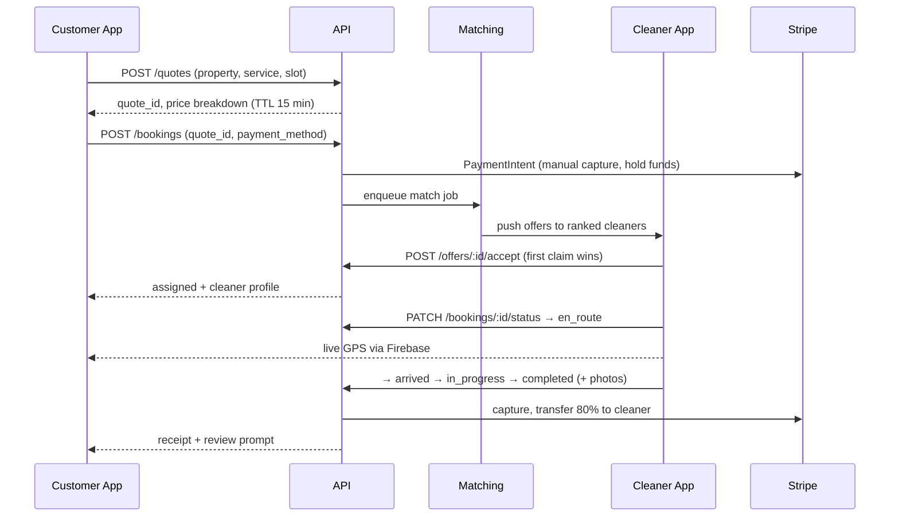

# Sparkle — On-Demand Cleaning Marketplace

Technical blueprint and MVP code structure for a three-sided marketplace: **Customer app (Flutter)**, **Cleaner app (Flutter)**, **Admin dashboard (web)**, backed by **Node.js/Express + PostgreSQL**.

This document is the source of truth. Everything else in the repo implements a piece of it.

```
sparkle-platform/
├── README.md                 ← this file (architecture, business logic, compliance)
├── docs/API.md               ← endpoint contracts for booking + payment flow
├── backend/migrations/       ← node-pg-migrate; 0001_init is the full schema
├── backend/                  ← Node.js/Express boilerplate
├── admin/                    ← Trust & Safety console (React)
├── infra/firebase/           ← Realtime DB security rules
└── mobile/                   ← Flutter cleaner + customer apps
```

---

## 1. MVP scope

Ship these, defer everything else:

| In (v1) | Out (v2+) |
|---|---|
| One metro area, one currency | Multi-region, multi-currency |
| Standard + Deep Clean | Move-out, carpet, commercial add-ons |
| Scheduled bookings (≥2h lead time) | True "now" dispatch |
| Broadcast-then-claim matching | Auto-assign with cleaner acceptance SLAs |
| Card payments, manual capture | Wallets, invoicing, subscriptions |
| Stripe Connect Express accounts | Instant payouts, Sparkle debit card |
| Ratings affect search rank | ML-based quality scoring |

The point of the "broadcast-then-claim" choice: a real dispatch algorithm needs supply-density data you won't have on day one. Rank offers, broadcast to the top N, let cleaners claim. Swap the strategy behind `MatchingService` later without touching the booking state machine.

---

## 2. System architecture



**Why the location stream bypasses the API.** (Rules: `infra/firebase/database.rules.json`.) Cleaner GPS during `en_route` writes straight to Firebase Realtime DB under `/tracking/{bookingId}`, with security rules scoped to the assigned cleaner (write) and the booking's customer (read). The backend never sees 10-second pings — it only persists a coarse breadcrumb every 60s for dispute evidence. This keeps your Express tier from carrying a write-heavy realtime workload it's bad at, and keeps your Postgres bill sane.

**Booking lifecycle.**



State machine (enforced in `BookingService`, mirrored by a DB trigger):

`draft → quoted → pending_match → assigned → en_route → arrived → in_progress → completed → settled`
with `canceled` reachable from any pre-`in_progress` state and `disputed` from `completed` within 72h.

---

## 3. Business logic and money math

All money is integer cents. Never floats, anywhere, including in Dart.

### Price composition

```
subtotal   = (base + bedrooms·rate_bd + bathrooms·rate_ba + size_tier_adj + addons)
             × service_multiplier
             × demand_multiplier
trust_fee  = TS_FLAT + round(subtotal × TS_PCT)      # capped
total      = subtotal + trust_fee + tax
commission = round(subtotal × 0.20)                   # platform, on subtotal only
payout     = subtotal − commission                    # cleaner
app_fee    = commission + trust_fee                   # Stripe application_fee_amount
```

Commission is charged on the **subtotal only** — never on the trust fee, and never on the tip. Taking a cut of a safety fee is the kind of thing that ends up in a screenshot on Reddit.

| Knob | v1 value | Where |
|---|---|---|
| Commission | 20% | `pricing_rules.commission_bps = 2000` |
| Deep Clean multiplier | 1.60× | `services.multiplier_bps` |
| Weekend (Sat/Sun) | 1.15× | `pricing_rules` scoped by DOW |
| Evening (after 17:00) | 1.10× | stacks multiplicatively, capped at 1.5× total |
| Trust &amp; Safety fee | $3.49 + 1% of subtotal, cap $9.99 | `pricing_rules` |
| Cancellation < 12h | 50% of subtotal to cleaner | `BookingService.cancel` |

Every quote persists the **fully resolved rule set** into `quotes.breakdown` (JSONB). When you change pricing next quarter, historical bookings must still explain themselves to a support agent.

### Worked example

3 bed / 2 bath, 1,600 sq ft, Standard Clean, Saturday 10:00.

| Line | Cents |
|---|---|
| Base | 4,900 |
| 3 bedrooms × 1,200 | 3,600 |
| 2 bathrooms × 1,500 | 3,000 |
| Size tier 1,500–2,000 sq ft | 1,500 |
| Subtotal before multipliers | 13,000 |
| Weekend ×1.15 | **14,950** |
| Trust &amp; Safety (349 + 1%) | 499 |
| **Customer pays** | **15,449** ($154.49) |
| Platform commission (20% of 14,950) | 2,990 |
| **Cleaner receives** | **11,960** ($119.60) |
| Stripe `application_fee_amount` | 3,489 |

(That $154.49 was $154.48 until `backend/test/pricing.test.js` disagreed with the README and the test was right — 1% of 14,950 is 149.5 cents, which rounds up. Worth pinning numbers like this in a test rather than a table.)

Use **destination charges** (`transfer_data.destination`, `on_behalf_of` the cleaner's account): the customer's statement shows Sparkle, funds route to the cleaner, and Stripe's processing fee comes out of the platform's slice — about $4.78 here, leaving ~$29.11 net on the booking. Model that number before you set commission at 20%; it's the whole business.

### Payment timing

1. **At booking**: PaymentIntent with `capture_method: manual`, ~10% buffer above quote for overage. Authorization holds up to 7 days.
2. **At completion**: capture the actual amount (`capture` ≤ authorized). Overruns beyond the buffer require an incremental authorization or a second PI.
3. **Transfer**: same request via `transfer_data`; funds land in the cleaner's Express account.
4. **Payout**: Stripe's daily schedule, `payouts.schedule.interval = daily`, 2-day delay. `payouts` table mirrors this for reconciliation — you reconcile against Stripe's ledger, never against your own assumptions.

Idempotency: every write to Stripe carries `Idempotency-Key: booking:{id}:{action}`. Every webhook is recorded in `webhook_events` before processing, keyed on Stripe's event id, and skipped if seen.

---

## 4. Matching engine

Runs when a booking hits `pending_match`, and again on offer expiry.

**Hard filters** (SQL `WHERE`):
- `background_check_status = 'clear'` and not expired
- `onboarding_status = 'approved'`, not suspended
- Serves the booking's service type
- Booking start falls in their availability, no overlapping booking ± travel buffer
- Within `service_radius_km` of the property (PostGIS `ST_DWithin` on `geography`)

**Soft ranking** (score 0–1, weights in `config`):

```
score = 0.35·proximity      # 1 − (dist / radius), road distance for top 30 via Distance Matrix
      + 0.30·quality        # Bayesian-smoothed rating: (Σr + C·m) / (n + C), C=10, m=4.6
      + 0.15·reliability    # completion rate, penalized for late cancels in last 60d
      + 0.10·acceptance     # offer acceptance rate, decayed
      + 0.10·fairness       # boost for cleaners below their 7-day earnings median
```

The Bayesian prior matters: a cleaner with one 5.0 review must not outrank one with 200 reviews at 4.85. The fairness term is not charity — a marketplace where the top 5% take everything loses the other 95% of supply within a month.

Broadcast to top 8, offer TTL 90s, first accept wins (`SELECT ... FOR UPDATE SKIP LOCKED` on the booking row). No claim after 3 rounds → widen radius 1.5×, drop the fairness term, alert ops.

**Review effect on visibility.** `cleaner_rating_snapshot` is recomputed by a worker on every new review. Cleaners below 4.3 over their last 20 jobs are excluded from broadcast and enter coaching; below 4.0 triggers admin review. This threshold lives in config, not in code, because you will tune it weekly.

---

## 5. Trust, safety, and security

- **Background checks**: Checkr Express invite at onboarding step 4. Documents (ID, insurance, right-to-work) go to S3 via presigned PUT — they never transit your API. `cleaner_documents` stores the key, SHA-256, and expiry; a worker re-runs checks annually.
- **Masked calling**: Twilio Proxy session created on `assigned`, torn down 2h after `completed`. Neither side ever sees a real number. Session SIDs in `masked_call_sessions` for dispute review; recordings off by default (two-party consent states).
- **Auth**: short-lived JWT access tokens (15 min) + rotating refresh tokens stored hashed, device-bound. Role and permission claims checked per route.
- **Geofencing**: `arrived` is only accepted when the cleaner's reported position is within 150 m of the property, or an ops override is logged. Same check on `completed`. This is your primary defense against fake completions.
- **PII at rest**: `pgcrypto` column encryption for document numbers and phone numbers; exact street address only revealed to the assigned cleaner after `assigned`, and hidden again 24h after `completed`.
- **Photos**: before/after photos required for Deep Clean, stored 90 days, auto-purged. They resolve ~80% of quality disputes without a human.

---

## 6. GDPR / CCPA compliance

Build these in now; retrofitting consent onto a live schema is miserable.

| Requirement | Implementation |
|---|---|
| Lawful basis + consent record | `consents` table: purpose, version, granted_at, ip, withdrawn_at. Marketing separate from service comms. |
| Right of access / portability | `GET /v1/me/export` enqueues a job; signed ZIP (JSON + CSV) emailed within 30 days, link expires in 72h. |
| Right to erasure | `DELETE /v1/me` → 14-day grace, then **crypto-shredding + tombstone**: PII columns nulled, row retained with `deleted_at`. Financial records survive erasure (legal retention, 7 years) — that exemption is real, document it in your privacy policy. |
| Data minimization | GPS breadcrumbs purged at 30 days; chat at 12 months; raw Checkr reports never stored, only status + report id. |
| CCPA "Do Not Sell/Share" | `users.dns_optout` flag; gates all ad-network and analytics SDK identifiers. |
| Audit trail | `audit_log` on every admin action touching a user record — append-only, no UPDATE grant for the app role. |
| Sub-processors | Stripe, Checkr, Twilio, Google, Firebase all under DPAs; EU data residency selected where offered. |
| Breach clock | Alerting on anomalous bulk reads of `users`/`addresses`; 72-hour notification runbook in ops. |

---

## 7. Scale path

The MVP is a modular monolith — one Express app, clear service boundaries, one database. That is correct for the first 18 months. When it stops being correct:

1. **Read replicas** first (search and admin analytics move off primary).
2. **Extract the matching engine** — it's the only genuinely latency-sensitive, CPU-shaped component, and the only one whose deploy cadence differs from the rest.
3. **Partition `bookings` and `booking_status_history` by month** once past ~50M rows.
4. **Outbox pattern** for anything that must not be lost when you go event-driven — the `webhook_events` table is already half of one.
5. **Sharding by metro** is the last resort and the natural boundary. Design ids as UUIDv7 now so it stays possible.

---

## 8. Getting it running

```bash
docker compose -f infra/docker-compose.yml up -d     # Postgres+PostGIS, Redis
cd backend
cp .env.example .env                                  # Stripe, Checkr, Twilio, Firebase, Maps keys
npm install
npm run migrate:up                                    # apply the schema (migrations, not a dump)
npm run seed                                          # realistic Merrimack Valley data
npm run create-admin -- ops@sparkle.app "Dana Osei"   # admins are never made over HTTP
npm run dev                                           # http://localhost:8080
npm run worker                                        # matching, payouts, ratings, retention
stripe listen --forward-to localhost:8080/v1/webhooks/stripe
```

Apps: `cd mobile/customer_app && flutter run` (or `cleaner_app`). Both ship a fake repository, so they run before the backend does.

`npm test` runs the domain math — no database, no network, about a quarter of a second. CI additionally runs the migrations against real PostGIS on every PR (and the booking state-machine integration suite on top), because a schema that is only ever read is a schema with undiscovered errors in it.

## Observability

Prometheus metrics at `GET /metrics` (bearer-gated by `METRICS_TOKEN` if set). Metrics are per-process, so there are two scrape targets: the API and the worker (on `WORKER_METRICS_PORT`). The counters that matter for the marketplace's two hardest questions — *are we matching supply to demand* and *are we collecting the money* — are `sparkle_bookings_created_total` / `sparkle_bookings_matched_total` (match rate), `sparkle_time_to_match_seconds` (a histogram), `sparkle_payment_capture_failures_total`, and `sparkle_webhook_processed_total` / `sparkle_webhook_lag_seconds`. A worker sweep sets `sparkle_bookings_stuck_pending_match` and logs an error-level alert line every minute a booking has sat in `pending_match` past two dispatch rounds. The registry is a small hand-rolled one (`src/observability/metrics.js`, unit-tested in `npm test`) rather than a dependency — swap it for prom-client behind the same `.inc()` / `.observe()` / `.set()` calls if it outgrows that.

## Load testing the matching query

`findCandidates` is the query a customer waits on: a PostGIS radius scan plus three correlated subqueries per candidate. `npm run loadtest:matching` (optionally `-- --cleaners 20000`) generates synthetic supply, `ANALYZE`s, and runs `EXPLAIN (ANALYZE, BUFFERS)` against the **exact** SQL production uses (extracted to `src/services/matching.candidates.sql.js`, so the measured query can't drift from the shipped one), then prints a verdict. The thing to watch: the `ST_DWithin` bound is a **per-row** radius (`c.service_radius_km * 1000 * $2`), which a GiST index can't accelerate — so if the plan shows a `Seq Scan on cleaner_profiles`, the fix is a constant-radius prefilter the index *can* use before the exact per-row check refines it. The harness cleans up after itself unless you pass `--keep`.
